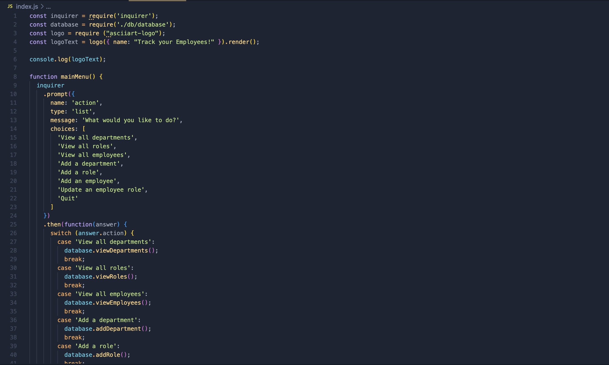
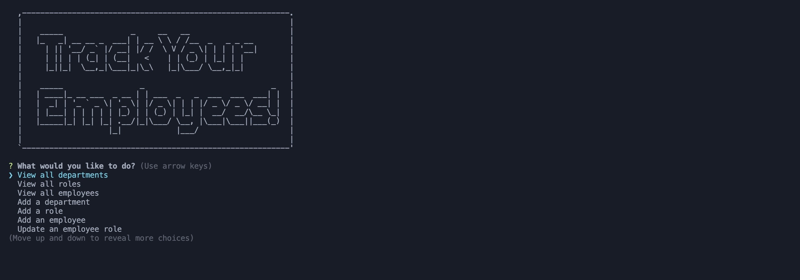

# Track your Employees

# Description

This project was built for the purpose of tracking employees within a business using CLI. I implemented inquirer, mysql2, and console.table for the CLI application. It takes the information from the database, and lists it in your terminal with prompts asking for more information on your search. I built the database using mySQL, and created tables for the listed information.

# Table of Contents
* [Installation](#installation)
* [Usage](#usage)
* [Credits](#credits)

# Installation

To install this project, clone the repository from GitHub and open it in your own IDE. Within your terminal, sign in to your mySQL account using mysql -p and run "USE employee_tracker" and then "source schema.sql" and "source seeds.sql". Once this is done, run npm install to install the dependencies.

# Video

https://drive.google.com/file/d/1zdnbUMM2cVJqWIVUWPUWlC_0VRxd6g6S/view

# Usage

In your IDE terminal, type npm start. Once the application runs, you will see "Track Your Employees!" and a menu below this. Scroll through the prompts, and you can view all departments, roles, and employees, as well as adding to these tables.

Screenshots of the code

# Credits

This application was built from scratch by Kyle Parks.